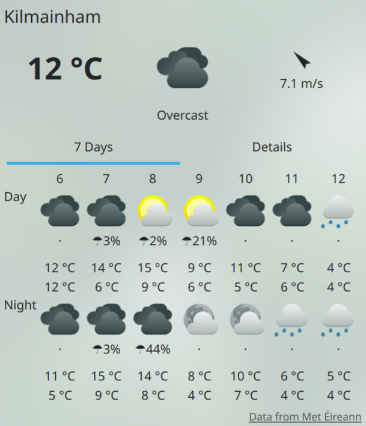

# plasma-ion-meteireann

Standalone KDE Plasma weather provider for [Met Éireann](https://www.met.ie/), the Irish Meteorological Service.

It adds a **Met Éireann** data source to the Plasma weather widget through the `plasma/weather_ions` plugin system.



## Runtime requirements

- Plasma 6 weather widget
- `kdeplasma-addons`
- Qt 6
- KDE Frameworks 6

The plugin uses the weather runtime libraries shipped by `kdeplasma-addons`:

- `libplasmaweatherion.so`
- `libplasmaweatherdata.so`

## Install with `yay`

```bash
git clone https://github.com/alysson-souza/plasma-ion-meteireann.git
cd plasma-ion-meteireann
yay -Bi .
```

After installation, restart `plasmashell` or log out and back in before adding the provider.

## Build manually

### Build requirements

- CMake >= 3.16
- Extra CMake Modules (ECM) >= 6.22
- Qt 6 >= 6.10
- KDE Frameworks 6 >= 6.22

### Arch / CachyOS build dependencies

```bash
sudo pacman -S --needed cmake extra-cmake-modules qt6-base qt6-declarative \
  kcoreaddons ki18n kio kunitconversion kdeplasma-addons
```

### Build

```bash
cmake -B build -S .
cmake --build build
```

### Install system-wide

```bash
sudo cmake --install build
```

After installation, restart `plasmashell` or log out and back in before adding the provider.

### Install for one user

```bash
cmake --install build --prefix ~/.local
```

If Plasma does not automatically discover a user-local install, make sure your session includes:

```bash
QT_PLUGIN_PATH=$HOME/.local/lib/qt6/plugins
```

and restart `plasmashell`.

## Using it

1. Open the Plasma weather widget configuration
2. Type your location into the search field
3. Select the result labeled with **`(Met Éireann)`**
4. Click **Apply** or **OK**

Location search is currently handled through Met Éireann website lookup endpoints.

## Forecast data source

Forecast data comes from Met Éireann's official Open Data weather forecast API:

- `http://openaccess.pf.api.met.ie/metno-wdb2ts/locationforecast`

## Met Éireann attribution

This project redisplays Met Éireann data. For redistribution, review:

- [NOTICE.met-eireann.txt](NOTICE.met-eireann.txt)
- [Met Éireann Open Data](https://www.met.ie/about-us/specialised-services/open-data)

## License

This repository is mixed-license:

- local project files are `GPL-2.0-or-later`
- vendored `include/ion.h` is `LGPL-2.0-or-later`
- vendored weather data headers in `include/` are `GPL-2.0-or-later`

See:

- [LICENSES/LGPL-2.0-or-later.txt](LICENSES/LGPL-2.0-or-later.txt)
- [LICENSES/GPL-2.0-or-later.txt](LICENSES/GPL-2.0-or-later.txt)
